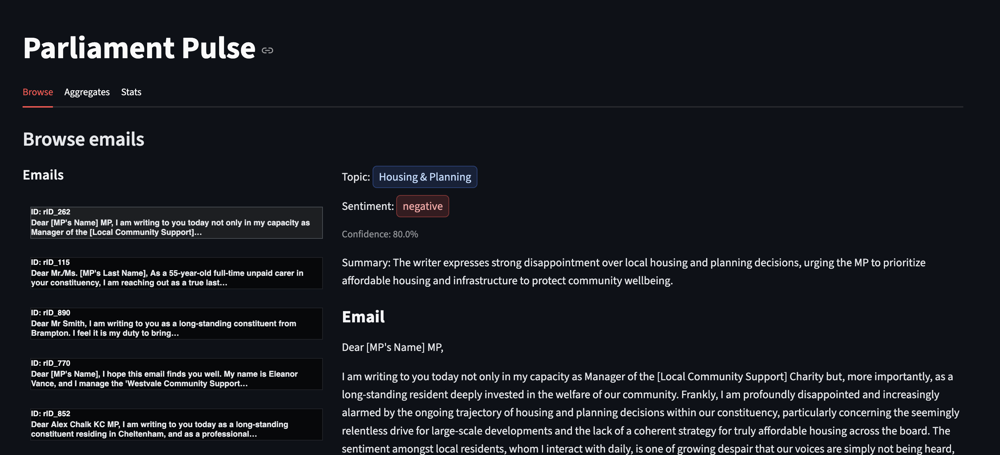
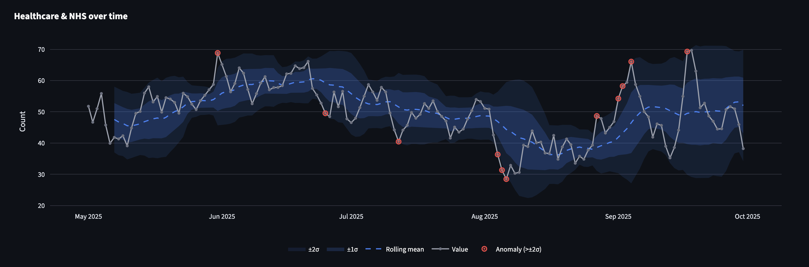
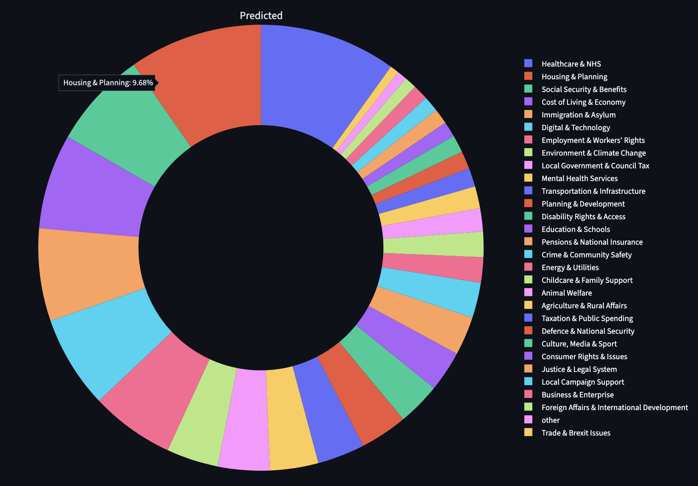
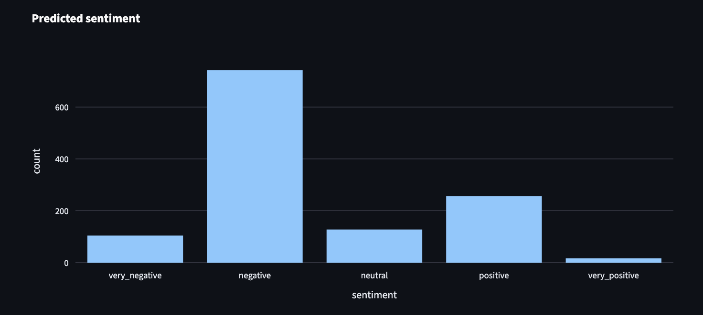

# Parliament Pulse – Local Streamlit POC

A Streamlit-only proof of concept demonstrating how locally run LLMs can analyze incoming constituent emails (topics and sentiment) and provide lightweight analytics for political representatives. No external APIs are used; models run on your machine via Ollama.

## What this does

- Local email analysis using one of two models:
  - gpt-oss:20b ("big")
  - llama3.1:8b-instruct ("small")
- Predictions: topic, sentiment, confidence, and a short summary per email
- Evaluation UI:
  - Browse tab: Outlook-style email list (left) + selected email with predictions (right). Hover to see true labels vs predictions.
  - Aggregates tab: interactive topic distribution (pie) and sentiment distribution (bar), with option to show true labels.
- Precompute pipeline for efficiency: batch-run a model over the dataset once, save results, and visualize quickly in the UI.

## Why local

- Privacy-first: emails never leave the machine
- Cost/predictability: no API bills, repeatable evaluation

## Requirements

- Python 3.9+
- UV package manager
- Ollama installed and running

## Setup

```bash
# 1) Install UV (if not installed)
curl -LsSf https://astral.sh/uv/install.sh | sh

# 2) Install project deps
uv sync

# 3) Pull models for Ollama
ollama pull gpt-oss:20b
ollama pull llama3.1:8b-instruct
```

## Precompute predictions (recommended)

The evaluator reads the dataset and writes predictions to `data/predictions_{small|big}.csv`. It resumes by default (skips already-processed rows) and shows a compact progress bar.

```bash
# Small model (llama 8B)
uv run python evaluate_emails.py --model small

# Big model (gpt-oss 20B)
uv run python evaluate_emails.py --model big

# Options:
#   --overwrite  	Recompute all rows
#   --limit N    	Process first N rows (for quick tests)
#   --verbose    	Print detailed logs instead of a progress bar
```

Inputs and outputs:

- Input dataset: `synthetic_data_creation/data_creation/emails_data/email_dataset_final.csv`
- Outputs:
  - `data/predictions_small.csv` (llama3.1:8b-instruct)
  - `data/predictions_big.csv` (gpt-oss:20b)

## Run the Streamlit UI

```bash
uv run streamlit run app.py
```

## UI Screenshots

### Browse tab


### Aggregates: Topic trend over time


### Aggregates: Topics distribution


### Aggregates: Sentiment distribution


### Using the UI

- Select model (small/big) from the sidebar.
- Browse tab: click any email card on the left to see the full email and predictions on the right.
  - Prediction badges show a check or cross; hover to see true labels when mismatched.
- Aggregates tab: topic pie and sentiment bars; toggle to show true labels.

## Architecture (current)

- Frontend: Streamlit app (`app.py`) – no separate backend/API.
- Batch evaluation: `evaluate_emails.py` calls Ollama through a local client (`backend/app/llm_processor.py`) and writes CSV outputs.
- Models: selected per run (small/big) and checked for availability via Ollama.

## Notes & limits

- Running gpt-oss:20b locally is resource-intensive; consider starting with the small model.
- The dataset’s topics column is a stringified list; the app parses it for comparison and charting.
- If you change the dataset, rerun the evaluator to refresh predictions.

## Project structure (relevant parts)

```
Pulse/
├── app.py                          # Streamlit UI (Browse, Aggregates, Stats)
├── evaluate_emails.py              # Batch precompute (small/big), writes data/predictions_*.csv
├── backend/app/llm_processor.py    # Ollama integration + robust JSON extraction
├── synthetic_data_creation/data_creation/emails_data/email_dataset_final.csv
└── data/
    ├── predictions_small.csv
    └── predictions_big.csv
```

## License

Project-specific license – see project documentation for details.

